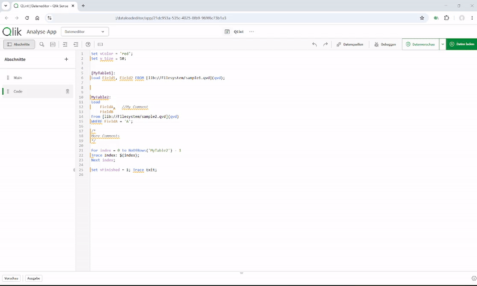

  
  <h1 align="center">qlint</h1>

  Opinionated linting and formatting utilities for Qlik script.

  

<table align="center">
  <tr><td align="center"></td></tr>
  <tr><td align="center"><b>Demo:</b> qlint in the Qlik Sense Data Load Editor</td></tr>
</table>

 

## Table of contents

- [Introduction](#introduction)
  - [Packages](#packages)
  - [How it's organized](#how-its-organized)
- [License](#license)
  - [Forbidden](#forbidden)

## Introduction

Everyone on your team writes Qlik script their own way? Nothing consistent, code hard to
read and a pain to maintain? qlint fixes that — it enforces a consistent, opinionated
style for Qlik load scripts, autoformats on demand, and flags violations where you write
them, so review time goes into logic instead of whitespace, casing, and keyword
conventions.

qlint ships in multiple flavors depending on how you work:

- a **Chrome extension** that hooks straight into the Qlik Sense Data Load Editor — no
  install, no terminal, just click and lint;
- a **CLI** for local checks, pre-commit hooks, and CI gates;
- a **VS Code extension** that brings linting and formatting into the editor _(early
  scaffold — integration in progress)_.

They are all powered by the same engine, so the rules you see in the browser are the exact
same rules that fail your pipeline.

### Packages

| Package                                                          | Audience                                | What it does                                                                                                                            |
| ---------------------------------------------------------------- | --------------------------------------- | --------------------------------------------------------------------------------------------------------------------------------------- |
| [**`@qlint/chrome-ext`**](./packages/chrome-ext)                 | Qlik developers, analysts, BI teams     | Chrome extension that injects inline lint feedback and one-click formatting directly into the Qlik Sense Data Load Editor.              |
| [**`@qlint/cli`**](./packages/cli)                               | Developers, CI/CD pipelines             | Command-line interface that lints and auto-fixes `.qvs` files from the terminal or as a CI step. Drop-in for pre-commit hooks and gates. |
| [**`qlint-vscode-ext`**](./packages/vscode-ext)                  | Developers editing `.qvs` in VS Code    | VS Code extension bringing linting and formatting into the editor. _Early scaffold — Core integration not wired up yet._                 |
| [**`@qlint/core`**](./packages/core)                             | Tool authors, IDE plugin developers     | The engine behind every binding — string-in, diagnostics-out. Embed it in your own editor integration, custom check runner, or service. |

### How it's organized

qlint is a monorepo with one dependency-free engine (`@qlint/core`) and a set of thin
bindings around it. The core owns the tokenizer, the complete ruleset, and the
formatting logic; it has no I/O and no platform assumptions, so it runs equally well in
Node, the browser, or a Web Worker. Every binding — CLI, Chrome extension, future IDE
plugins — handles only its platform concerns and delegates every linting and formatting
decision to core. That means a single source of truth for style and one place to add or
tune rules.

For the full list of built-in rules and their options, see
[`packages/core/docs/rules.md`](./packages/core/docs/rules.md).

## License

Copyright (c) 2026 Constantin Müller

Permission is hereby granted, free of charge, to any person obtaining a copy
of this software and associated documentation files (the "Software"), to deal
in the Software without restriction, including without limitation the rights
to use, copy, modify, merge, publish, distribute, sublicense, and/or sell
copies of the Software, and to permit persons to whom the Software is
furnished to do so, subject to the following conditions:

The above copyright notice and this permission notice shall be included in all
copies or substantial portions of the Software.

THE SOFTWARE IS PROVIDED "AS IS", WITHOUT WARRANTY OF ANY KIND, EXPRESS OR
IMPLIED, INCLUDING BUT NOT LIMITED TO THE WARRANTIES OF MERCHANTABILITY,
FITNESS FOR A PARTICULAR PURPOSE AND NONINFRINGEMENT. IN NO EVENT SHALL THE
AUTHORS OR COPYRIGHT HOLDERS BE LIABLE FOR ANY CLAIM, DAMAGES OR OTHER
LIABILITY, WHETHER IN AN ACTION OF CONTRACT, TORT OR OTHERWISE, ARISING FROM,
OUT OF OR IN CONNECTION WITH THE SOFTWARE OR THE USE OR OTHER DEALINGS IN THE
SOFTWARE.

[MIT License](https://opensource.org/licenses/MIT) or [LICENSE](LICENSE) for
more details.

### Forbidden

**Hold Liable**: Software is provided without warranty and the software
author/license owner cannot be held liable for damages.
